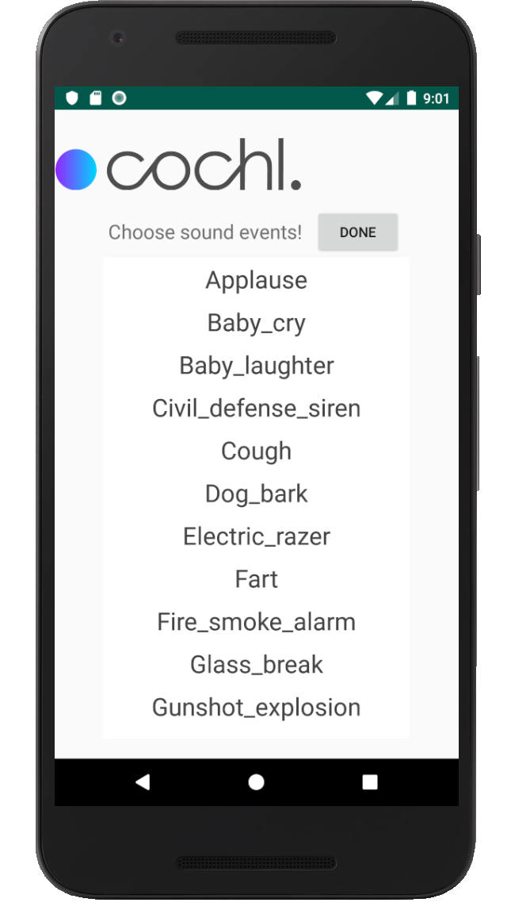

# Sense SDK Demo



In order to build Sense SDK Demo, you would require SDK key and Sense SDK (`sense-sdk-release.aar`). Please contact us by e-mail (support@cochlear.ai).

  1. Copy `sense-sdk-release.aar` file to `app/libs` directory
  2. Enter your SDK key into `app/src/main/java/ai/cochlear/sdk/examples/sampleapp/MainActivity.java` source file

  ```java
  package ai.cochlear.sdk.examples.sampleapp;

  (...)

  public class MainActivity extends AppCompatActivity {
      (...)
      private final String sdkKey = "ENTER YOUR SDK KEY";
      (...)
  }
  ```
  3. Build and run Sense SDK Demo
