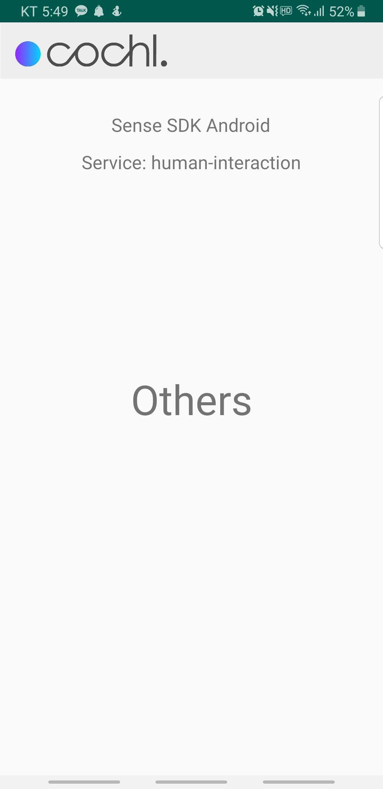

# Simple Event
Simple Sound Event Detection Android App (On-Device AI)



In order to build Simple Event, you would require SDK key and Sense SDK (`sense-sdk-<version>.aar`). Please contact us by e-mail (support@cochlear.ai).

  1. Copy `sense-sdk-<version>.aar` file to `app/libs` directory
  2. Enter your SDK key into `app/src/main/java/ai/cochlear/examples/simpleevent/MainActivity.java` source file

  ```java
  package ai.cochlear.examples.simpleevent;

  (...)

  public class MainActivity extends AppCompatActivity {
      (...)
      private final String sdkKey = "<ENTER YOUR SDK KEY HERE>";
      (...)
  }
  ```
  3. Build and run Simple Event App

## Demo

[](https://www.youtube.com/watch?v=jQ2ytyOVTO0)
